Olá, bem-vindo ao projeto Otica Vida!

Este é um projeto feito com os conhecimentos em ReactJS, HTML5 e CSS.

AVISO: Este projeto NÃO possui finalidade lucrativa, feito somente para colocar em prática o estudo!

O projeto tem como finalidade apresentar um site de ótica. O projeto é respinsivo, sendo utilizado FlexBox e Media Query para a responsividade.

No topo da página possui uma navbar minimalista, com links nos quais redirecionam para partes da própria página. 

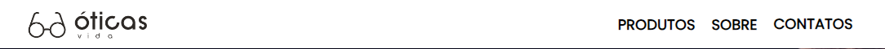

Note que ao passar o mouse em cima dos links, eles realizam uma animação aparecendo um card sobre as palavras, e as mesmas mudam de cor suavemente para se adaptar ao card.

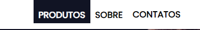

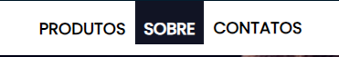

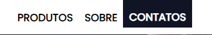

As imagens abaixo apresentam o site:

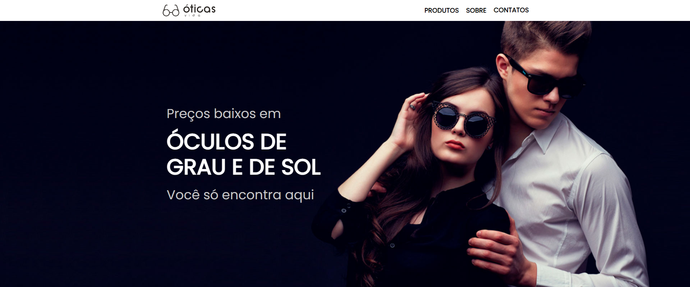

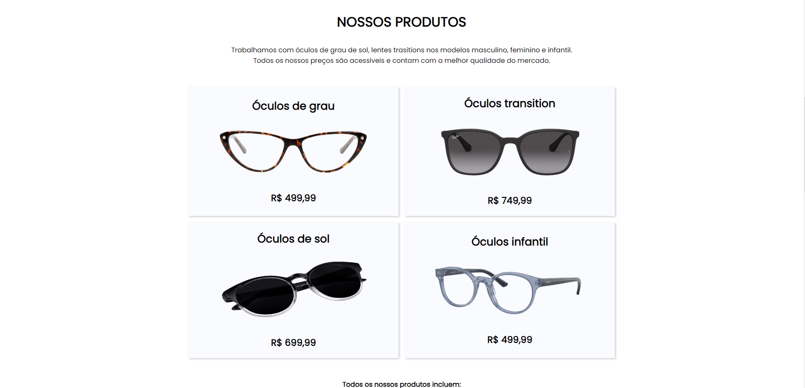

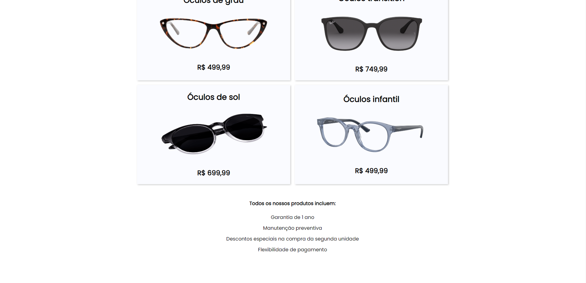

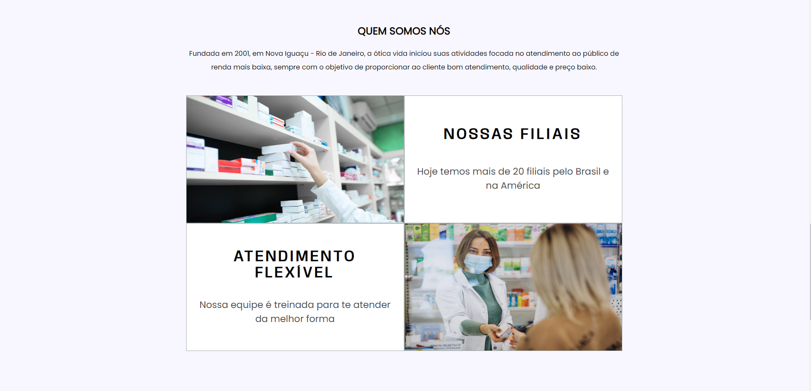

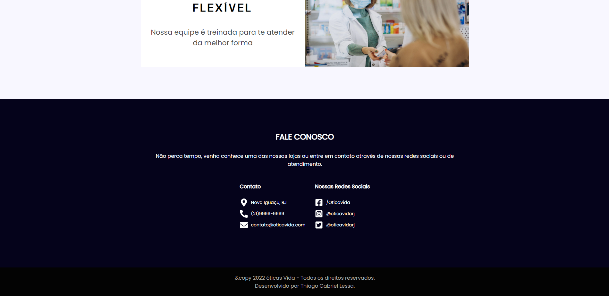

O site também é responsivo, se adaptando a todo o tipo de tela:

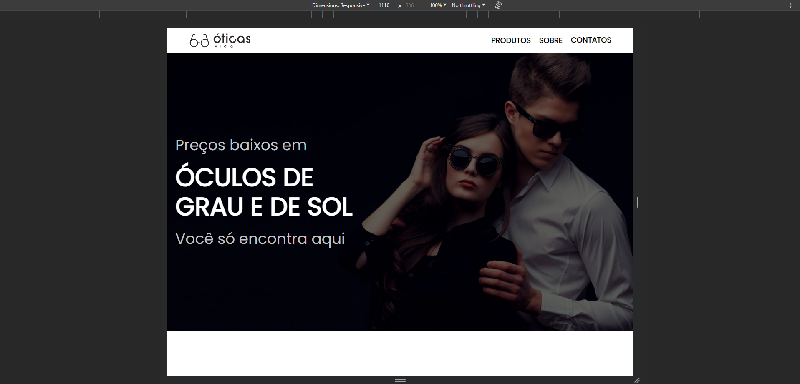

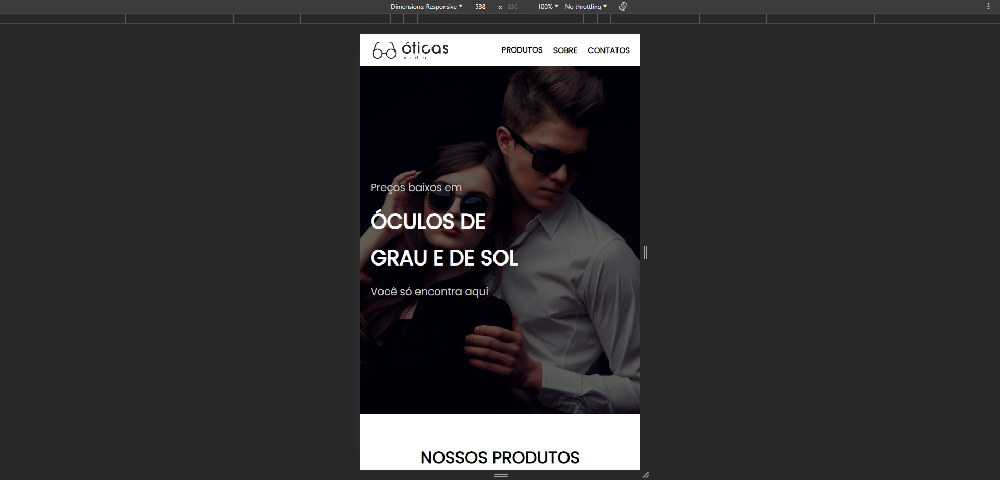

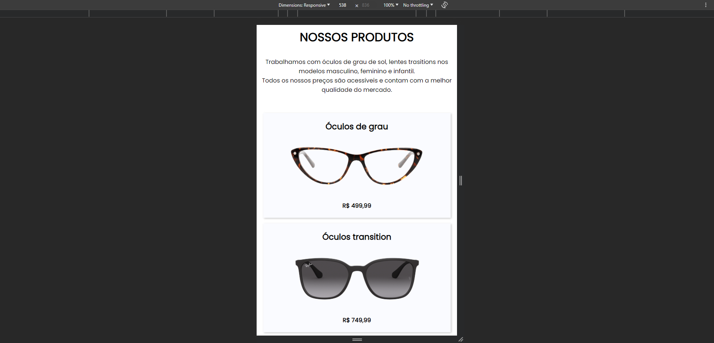

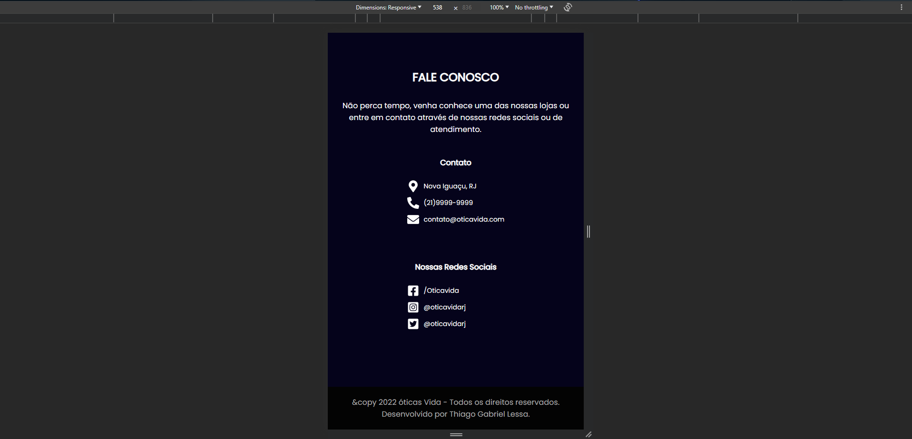

